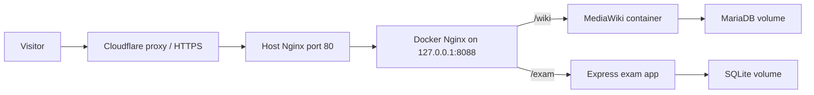

# KorewaDiscord Underground

Discord-community website with two sections:

- `https://underground.korewadiscord.com/wiki` runs MediaWiki.
- `https://underground.korewadiscord.com/exam` runs a custom quiz/exam app.

The stack is Docker Compose, Nginx, MediaWiki, MariaDB, Express, and SQLite. Secrets live in `.env`, which is ignored by Git.

## Architecture



Host Nginx accepts the public domain and forwards to the project Docker Nginx. Docker Nginx routes `/wiki` to MediaWiki and `/exam` to the exam app. MediaWiki uses MariaDB for pages and a Docker volume for uploads. The exam app uses SQLite in a Docker volume and seeds one sample test on first start.

## File Structure

```text
.
├── docker-compose.yml
├── .env.example
├── deploy/
│   └── nginx/
├── nginx/
│   └── default.conf
├── wiki/
│   ├── Dockerfile
│   ├── LocalSettings.override.php
│   └── docker-entrypoint.sh
├── exam/
│   ├── Dockerfile
│   ├── package.json
│   ├── public/
│   ├── src/
│   ├── tests/
│   └── views/
└── scripts/
    ├── backup.sh
    ├── cloudflare-dns.sh
    ├── deploy.sh
    ├── install-nginx-site.sh
    └── restore.sh
```

## Environment Setup

Create a real environment file locally and on the VPS:

```bash
cp .env.example .env
```

Set these values in `.env`:

```bash
MEDIAWIKI_ADMIN_USER=ryfried
MEDIAWIKI_ADMIN_PASSWORD=<admin-password>
EXAM_ADMIN_USER=ryfried
EXAM_ADMIN_PASSWORD=<admin-password>
EXAM_SESSION_SECRET=<long-random-string>
EXAM_COOKIE_SECURE=false
MEDIAWIKI_DB_PASSWORD=<long-random-string>
MEDIAWIKI_DB_ROOT_PASSWORD=<long-random-string>
```

Do not commit `.env`.

Use `EXAM_COOKIE_SECURE=false` for local `http://localhost` testing. On the VPS, set `EXAM_COOKIE_SECURE=true` once Cloudflare is proxying HTTPS to `underground.korewadiscord.com`.

Use `NGINX_HTTP_BIND=80` for a standalone local Compose stack. On a VPS that already has host Nginx on port 80, use `NGINX_HTTP_BIND=127.0.0.1:8088` and install the host Nginx site with `scripts/install-nginx-site.sh`.

## Local Setup

Run everything through Docker Compose:

```bash
docker compose up -d --build
docker compose ps
```

Then open:

- `http://localhost/wiki`
- `http://localhost/exam`
- `http://localhost/exam/admin`

For exam-only development:

```bash
cd exam
npm install
npm test
npm start
```

## Exam Features

The exam app supports:

- Discord ID or username entry before test selection.
- Visible `OPENED` and `CLOSED` test list.
- Disabled start buttons for `CLOSED` tests.
- Instructions and confirmation before a test begins.
- One timer per question, configured per test.
- Automatic move to the next question when time expires.
- Multiple tests per user, but one active/submitted attempt per Discord ID per test.
- Admin reset of a specific attempt, which marks the old attempt as `RESET` and allows a retake.

The initial seed creates `KorewaDiscord Community Basics` with 20 multiple-choice questions, 5 short essay questions, and a 60-second timer per question.

## Admin Usage

Open `/exam/admin` and log in with the credentials from `.env`.

Create tests from the dashboard or the tests page. New tests start as `CLOSED` drafts. Edit title, description, instructions, status, timer duration, questions, options, option order, and correct answers. Set status to `OPENED` when the test is ready.

Use the attempts page to filter submissions by test or Discord ID, inspect answers, and reset a user attempt for one specific test.

## Duplicate Attempt Rule

The `attempts` table has a partial unique index:

```sql
CREATE UNIQUE INDEX attempts_one_active_per_test
ON attempts (test_id, normalized_discord_id)
WHERE status IN ('IN_PROGRESS', 'SUBMITTED');
```

This blocks duplicate in-progress or submitted attempts for the same Discord ID and test. Resetting an attempt changes its status to `RESET`, which frees the user to retake that test.

## VPS Deployment

Target:

```text
ryfried@minebotserv:/home/ryfried/korewadiscord/
```

From this repository:

```bash
bash scripts/deploy.sh
```

If the remote `.env` does not exist, the script creates it from `.env.example` and stops. SSH into the VPS, edit the real secrets, then rerun deployment:

```bash
ssh ryfried@minebotserv
cd /home/ryfried/korewadiscord
nano .env
docker compose up -d --build
bash scripts/install-nginx-site.sh
docker compose ps
```

Useful operational commands:

```bash
docker compose logs -f nginx exam mediawiki
docker compose restart exam
docker compose restart mediawiki
docker compose down
docker compose up -d
```

## Cloudflare DNS and HTTPS

In Cloudflare for `korewadiscord.com`:

1. Create an `A` record named `underground` pointing to the VPS public IPv4 address.
2. Turn on the orange-cloud proxy for the record.
3. Set SSL/TLS mode to `Full` or `Full (strict)` if you install a trusted certificate on the VPS.
4. Keep host Nginx listening on origin port `80`, with Docker Nginx bound privately through `NGINX_HTTP_BIND=127.0.0.1:8088` on the VPS.

Optional API helper:

```bash
export CF_API_TOKEN=<cloudflare-token>
export CF_ZONE_ID=<zone-id>
export ORIGIN_IP=<vps-public-ip>
bash scripts/cloudflare-dns.sh
```

The helper creates or updates the proxied `underground.korewadiscord.com` `A` record. It requires `curl` and `jq`.

## Backup

Run from the deployment directory on the VPS:

```bash
set -a
source .env
set +a
bash scripts/backup.sh
```

This writes a timestamped archive containing:

- `mediawiki.sql`
- `wiki_images`
- `exam.sqlite`

Restore from an extracted backup directory:

```bash
set -a
source .env
set +a
bash scripts/restore.sh backups/20260101-120000
```

## Testing Checklist

- `/wiki` loads the MediaWiki main page.
- MediaWiki admin login works with the `.env` credentials.
- A new wiki account can be created.
- Logged-in wiki users can edit pages.
- `/exam` asks for Discord ID or username.
- Open and closed tests are both visible.
- Closed tests cannot be started.
- The seeded open test starts after confirmation.
- Timer moves to the next question after 60 seconds.
- Final submit records answers.
- The same Discord ID cannot submit the same test twice.
- Admin can create, edit, open, close, and archive tests.
- Admin can view attempts and reset a specific user attempt.
